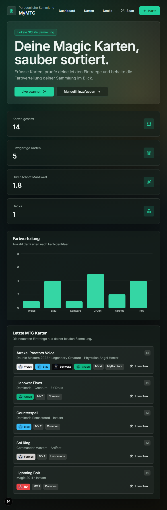
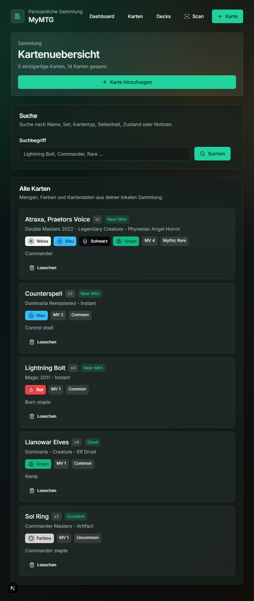
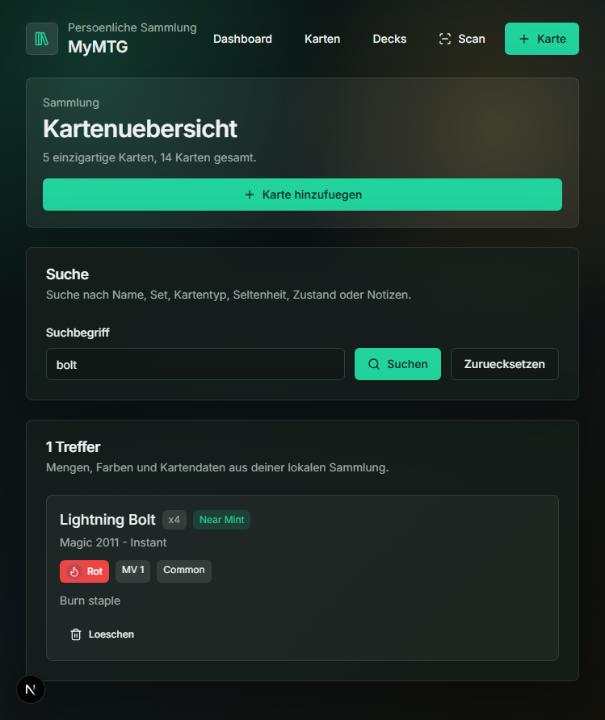
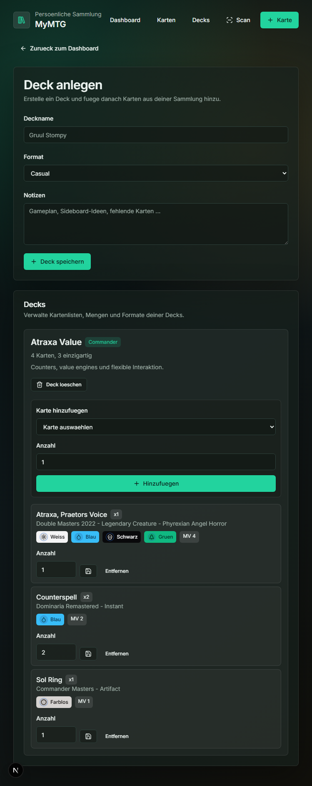
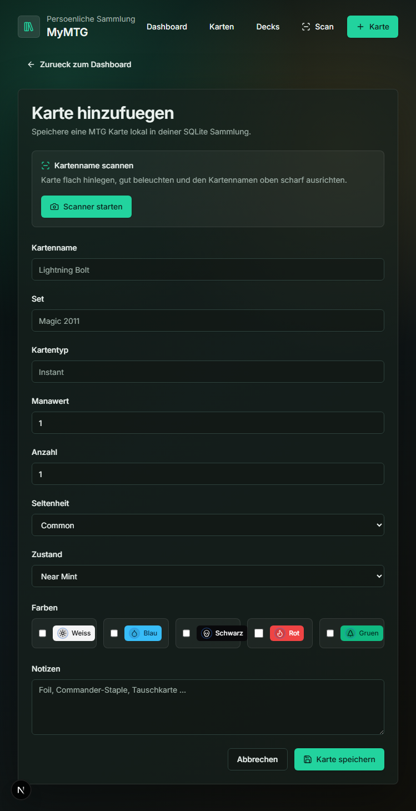
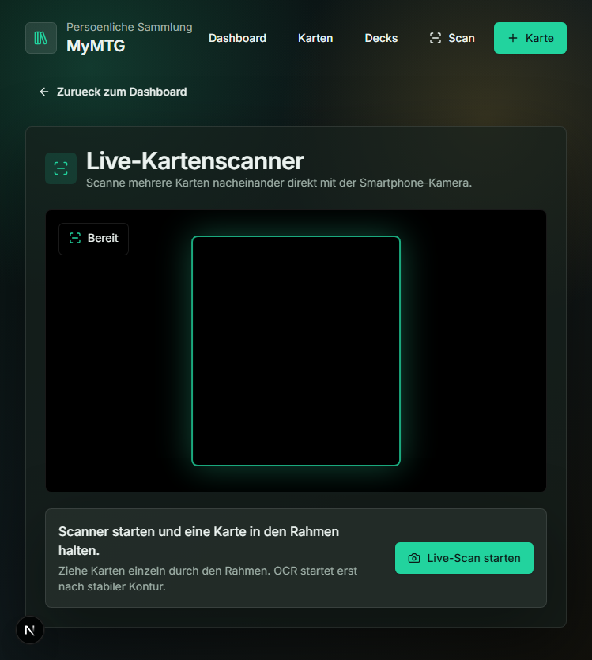

# MyMTG

Lokale Magic: The Gathering Sammlung mit SQLite, Deckverwaltung und Live-Scanner.
Die App ist mit Next.js gebaut und speichert Karten lokal in `data/mymtg.sqlite`.

## Funktionen

- Karten manuell erfassen
- Karten per Smartphone-Kamera live scannen
- OCR-Erkennung des Kartennamens mit Tesseract.js
- Abgleich erkannter Karten gegen Scryfall
- Kartenuebersicht mit Suche
- Karten wieder loeschen
- Decks anlegen und Karten mit Mengen zuordnen
- Farbverteilung und Sammlungsstatistiken auf dem Dashboard
- Capacitor-iOS-Projekt fuer Tests auf dem iPhone

## Screenshots

### Dashboard



### Kartenuebersicht



### Kartensuche



### Deckverwaltung



### Karte manuell hinzufuegen



### Live-Scan



## Voraussetzungen

- Node.js
- npm
- Docker fuer Server-Deployment
- Fuer iOS: macOS mit Xcode

## Installation

```powershell
npm install
```

## Entwicklung starten

```powershell
npm run dev
```

Die App laeuft danach unter:

```text
http://localhost:3000
```

Fuer Tests im lokalen Netzwerk, zum Beispiel vom iPhone aus:

```powershell
npm run dev -- -H 0.0.0.0 -p 3000
```

## Build und Checks

```powershell
npm run build
npx tsc --noEmit
```

## Docker

Image bauen:

```bash
docker build -t mymtg .
```

Container mit persistentem SQLite-Volume starten:

```bash
docker run -d --name mymtg -p 3000:3000 -v mymtg-data:/app/data mymtg
```

Die App ist danach unter `http://localhost:3000` erreichbar. Die Datenbank wird
im Volume `mymtg-data` gespeichert.

### Serverbetrieb

Der Container nutzt standardmaessig:

```text
PORT=3000
DATA_DIR=/app/data
```

`DATA_DIR` zeigt auf das Verzeichnis, in dem `mymtg.sqlite` angelegt wird. Wenn
du statt eines Docker-Volumes ein Host-Verzeichnis mounten willst:

```bash
docker run -d \
  --name mymtg \
  -p 3000:3000 \
  -v /srv/mymtg/data:/app/data \
  mymtg
```

Backup der SQLite-Datenbank aus einem Docker-Volume:

```bash
docker run --rm -v mymtg-data:/data -v "$PWD":/backup alpine \
  cp /data/mymtg.sqlite /backup/mymtg.sqlite
```

Fuer produktiven Betrieb empfiehlt sich ein Reverse Proxy mit HTTPS, zum Beispiel
Caddy, Traefik oder nginx. HTTPS ist auch wichtig, wenn der Kamera-Scanner aus
einem mobilen Browser genutzt werden soll.

## Datenhaltung

Die SQLite-Datenbank liegt lokal unter:

```text
data/mymtg.sqlite
```

Der Ordner `data` ist bewusst in `.gitignore`, damit lokale Sammlungen nicht
committet werden.

Im Docker-Container liegt die Datenbank unter:

```text
/app/data/mymtg.sqlite
```

## Scanner

Der Live-Scanner nutzt die Kamera im Browser, erkennt Kartenkonturen im Videobild
und liest den Kartennamen per OCR aus. Danach wird der Name gegen Scryfall
abgeglichen und die Karte kann direkt der Sammlung hinzugefuegt werden.

Hinweise:

- Desktop-Browser brauchen fuer Kamera-Zugriff `localhost` oder HTTPS.
- iPhone Safari blockiert Kamera-Zugriff ueber `http://<LAN-IP>`.
- Fuer iPhone-Tests ist die Capacitor-App vorgesehen.

## Capacitor iOS

Die App nutzt Next.js Server Actions, API-Routes und `better-sqlite3`. Deshalb
ist die iOS-App aktuell eine native Capacitor-Huelle gegen einen laufenden
Next-Server im lokalen Netzwerk.

Next-Server im Netzwerk starten:

```powershell
npm run dev -- -H 0.0.0.0 -p 3000
```

LAN-IP ermitteln:

```powershell
ipconfig
```

Capacitor fuer diese Server-URL synchronisieren:

```powershell
$env:CAP_SERVER_URL = "http://<deine-ip>:3000"
npm run cap:sync:ios
```

Auf einem Mac in Xcode oeffnen:

```bash
npm run cap:open:ios
```

Weitere Details stehen in [CAPACITOR.md](CAPACITOR.md).

## Scripts

```text
npm run dev          Next-Dev-Server starten
npm run build        Production-Build erstellen
npm run start        Production-Server starten
npm run cap:sync     Capacitor synchronisieren
npm run cap:sync:ios iOS-Projekt synchronisieren
npm run cap:open:ios iOS-Projekt in Xcode oeffnen
npm run cap:run:ios  iOS-App starten
```

## Projektstruktur

```text
app/                 Next.js App Router Seiten und API-Routes
components/          UI- und Scanner-Komponenten
lib/                 Datenbank, Scryfall- und Scanner-Logik
ios/                 Capacitor iOS-Projekt
docs/screenshots/    README-Screenshots
capacitor-www/       Capacitor-Fallback-WebDir
data/                Lokale SQLite-Datenbank, nicht versioniert
```
